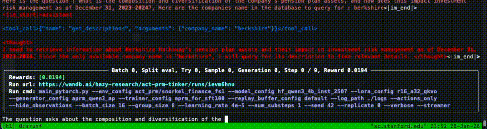

# Act-PRM (Tinker)

Tinkering with Action Process Reward Models (Act-PRMs)



## Setup

### Dependencies

To install dependencies and manage packages, we use `uv`. You can install it from [here](https://docs.astral.sh/uv/installation/).

Then, install dependencies with `uv sync`. Or, just run one of the example scripts below (`uv` will automatically install / update dependencies in `pyproject.toml` as needed).

### Tinker

We currently use [Tinker](https://thinkingmachines.ai/tinker/) to run experiments. You'll want to:  
1. Sign up for Tinker [here](https://auth.thinkingmachines.ai/sign-up)  
2. Create an API key from the [console](https://tinker-console.thinkingmachines.ai/)
3. Either export this as an environment variable (e.g., `export TINKER_API_KEY="<your_api_key>"`) or add it to a `.env` file (recommended, see below).

### Setting Environment Variables

To manage API keys for Tinker, WandB, and Hugging Face, we use `dotenv` to load environment variables from a `.env` file. 
Create a `.env` file in this project's root directory (e.g., `vim .env`), and add your environment variables, e.g.,

```markdown
TINKER_API_KEY="<your_tinker_api_key>"
HF_TOKEN="<your_huggingface_token>"
WANDB_API_KEY="<your_wandb_api_key>"
WANDB_ENTITY="hazy-research"
```

If you haven't already, add this `.env` file to your `.gitignore` file to avoid leaking keys and committing it to the repository.

### PyTorch

We've also implemented sufficient training and generation code in PyTorch. See the `pytorch` branch for files under `src/act_prm/pytorch/`.

#### FlashAttention-2

To use the wonderful [FlashAttention-2](https://github.com/Dao-AILab/flash-attention), simply do the following:  

1. Install other dependencies as usual with `uv sync` (or just running an example command, which automatically installs dependencies in `pyproject.toml` as needed).  

2. Install FlashAttention-2 with `uv pip install flash-attn --no-build-isolation-package flash-attn`

### Environments

Please see individual environment README files in `src/act_prm/environments/` for any additional setup instructions.

## Example Commands

### Motivating Example: TextWorld (Treasure Hunter)

```bash
CUDA_VISIBLE_DEVICES=0 \
uv run python main.py \
--is_async \
--env_config act_prm/textworld_fs1 \
--eval_env_config textworld/treasure_hunter \
--generator_config default \
--trainer_config qwen3_4b_aprm100_sft200_rl200 \
--replay_buffer_config default \
--log_path ./logs \
--model_name Qwen/Qwen3-4B-Instruct-2507 \
--lora_rank 32 \
--seed 42 --replicate 5 --verbose
```
