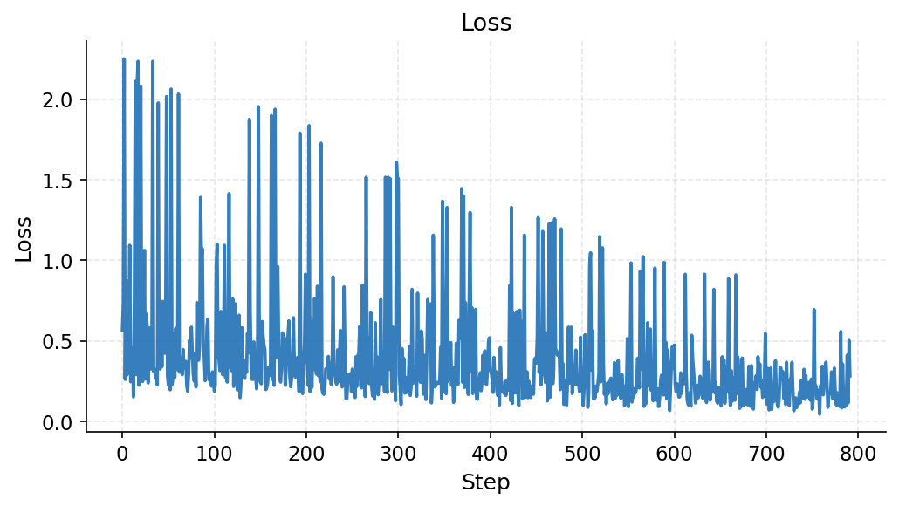
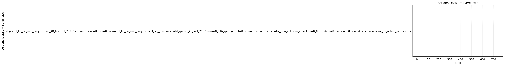
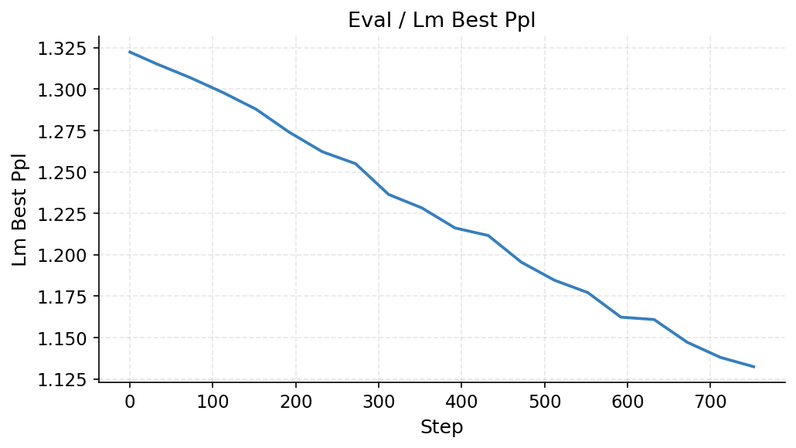
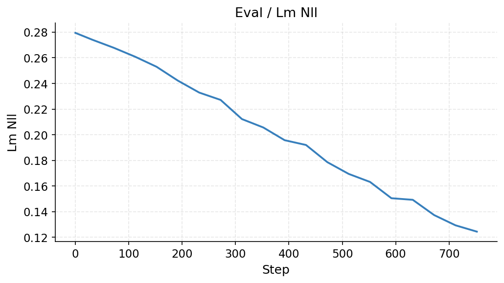
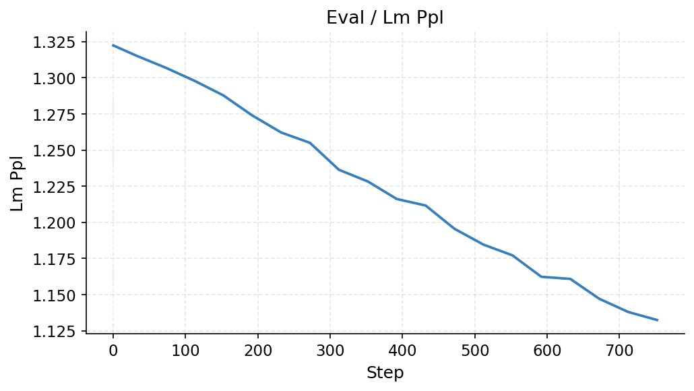
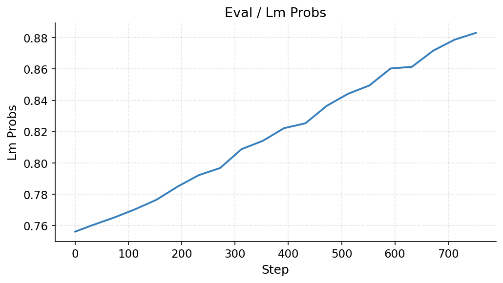
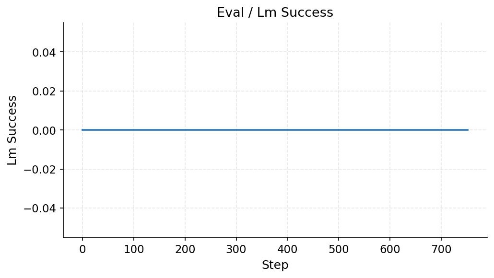
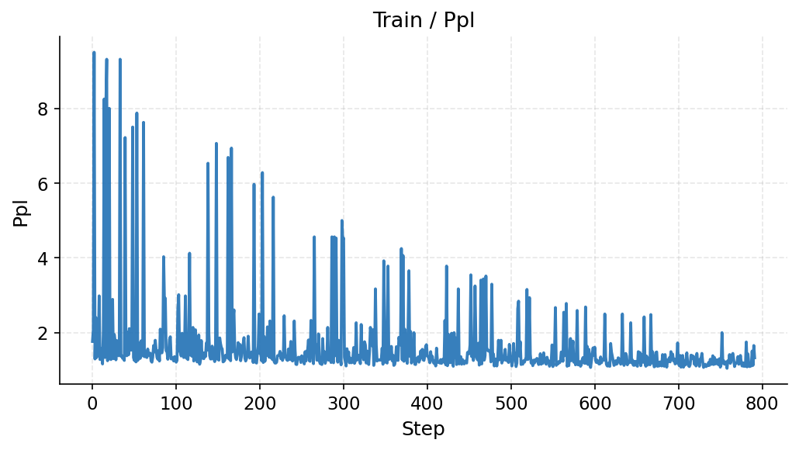
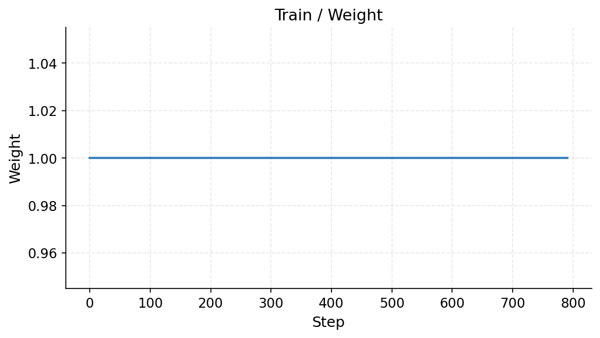

# Training Report: coin-easy-r0-s0

> Auto-generated 2026-03-07 01:36 UTC from [W&B run](https://wandb.ai/hazy-research/act-prm-cc/runs/h2etpcdg)

## Run Metadata

| Field | Value |
|-------|-------|
| **Run ID** | `h2etpcdg` |
| **Status** | running |
| **Started** | 2026-03-07T01:07:25Z |
| **Steps** | 791 |
| **env_config** | `act_lm/tw_coin_easy` |
| **eval_env_config** | `textworld/coin_collector_easy` |
| **model_config** | `hf_qwen3_4b_inst_2507` |
| **lora_config** | `r8_a16_qkvo` |
| **trainer_config** | `pt_sft_gen5` |
| **learning_rate** | `0.001` |
| **mini_batch_size** | `8` |
| **gradient_accumulation_steps** | `8` |
| **seed** | `0` |
| **replicate** | `0` |
| **data_seed** | `0` |
| **group_size** | `None` |
| **hide_observations** | `True` |
| **actions_only** | `True` |

## Latest Metrics

| Metric | Value |
|--------|-------|
| actions_data_lm_save_path | ./logs/act_lm_tw_coin_easy/Qwen3_4B_Instruct_2507/act-prm-cc-isas=0-reru=0-enco=act_lm_tw_coin_easy-trco=pt_sft_gen5-moco=hf_qwen3_4b_inst_2507-loco=r8_a16_qkvo-gracst=8-acon=1-hiob=1-evenco=tw_coin_collector_easy-lera=0_001-mibasi=8-evrost=100-se=0-dase=0-re=0/eval_lm_action_metrics.csv |
| eval/lm_best_ppl | 1.132453 |
| eval/lm_longest | 0 |
| eval/lm_nll | 0.124386 |
| eval/lm_ppl | 1.132453 |
| eval/lm_probs | 0.883039 |
| eval/lm_success | 0 |
| train/loss | 0.283203 |
| train/ppl | 1.328125 |
| train/weight | 1 |

## Training Curves

### Loss

### Actions Data Lm Save Path

### Eval / Lm Best Ppl

### Eval / Lm Longest

### Eval / Lm Nll

### Eval / Lm Ppl

### Eval / Lm Probs

### Eval / Lm Success

### Train / Ppl

### Train / Weight

