# Training Report: act-lm-snorkel-finance-aprm-fs1-15-rgen0_sl-s0

> Auto-generated 2026-03-07 01:10 UTC from [W&B run](https://wandb.ai/hazy-research/act-prm-tinker/runs/i22vj9h6)

## Run Metadata

| Field | Value |
|-------|-------|
| **Run ID** | `i22vj9h6` |
| **Status** | crashed |
| **Started** | 2026-01-26T22:40:03Z |
| **Steps** | 5727 |
| **env_config** | `act_lm/snorkel_finance_aprm_fs1_15` |
| **eval_env_config** | `None` |
| **model_config** | `hf_qwen3_4b_inst_2507` |
| **lora_config** | `r16_a32_qkvo` |
| **trainer_config** | `pt_sft_gen5` |
| **learning_rate** | `4e-05` |
| **mini_batch_size** | `None` |
| **gradient_accumulation_steps** | `None` |
| **seed** | `0` |
| **replicate** | `gen0_sl` |
| **group_size** | `None` |
| **hide_observations** | `True` |
| **actions_only** | `None` |

## Latest Metrics

| Metric | Value |
|--------|-------|
| eval/best_ppl | 1.943088 |
| eval/eval_idx | 12 |
| eval/gen_longest_per_task | 1.555556 |
| eval/gen_success_per_task | 0 |
| eval/nll | 0.664594 |
| eval/ppl | 1.943701 |
| eval/probs | 0.514482 |
| eval/step_act_acc | 0.302633 |
| eval/task_longest | 0 |
| eval/task_success | 0 |
| train/loss | 2.515625 |
| train/ppl | 12.375000 |
| train/weight | 0.244896 |

## Training Curves

### Loss

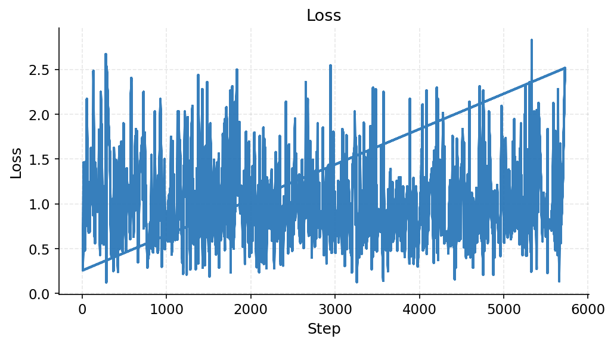

### Eval / Best Ppl

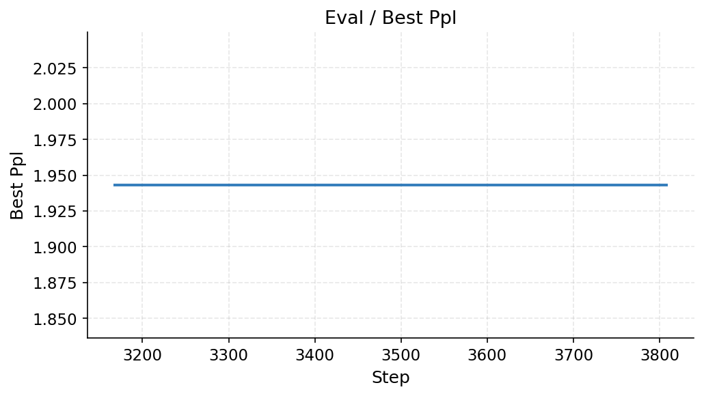

### Eval / Eval Idx

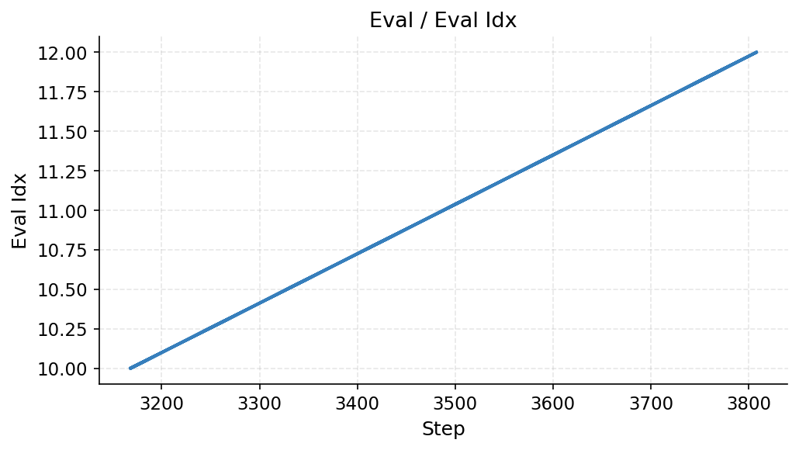

### Eval / Gen Longest Per Task

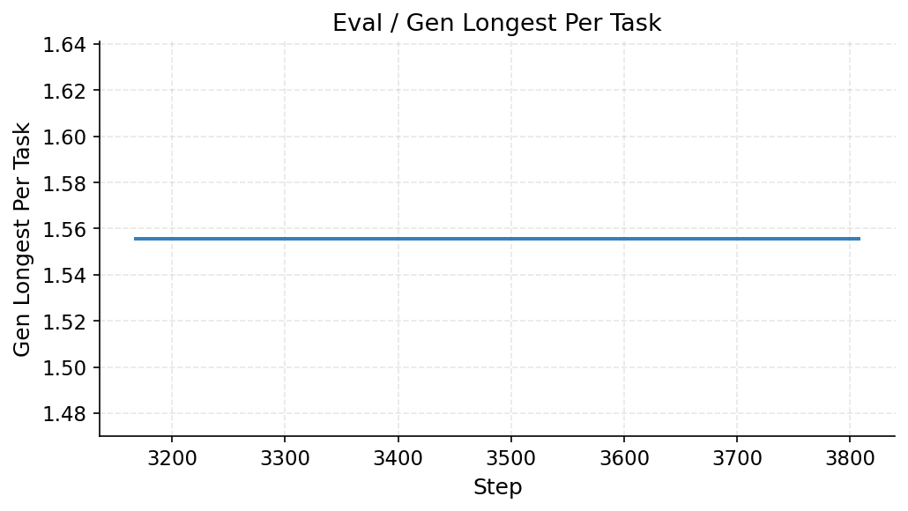

### Eval / Gen Success Per Task

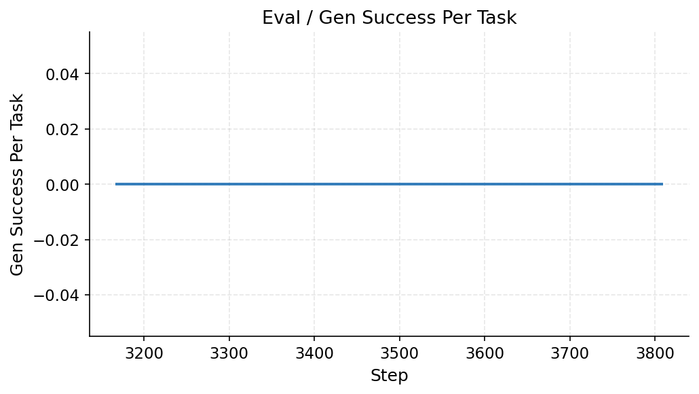

### Eval / Nll

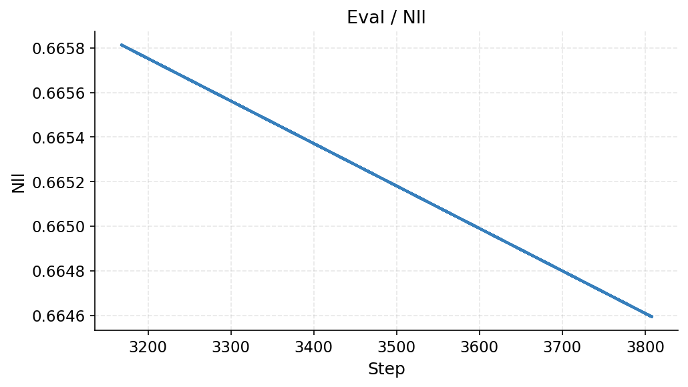

### Eval / Ppl

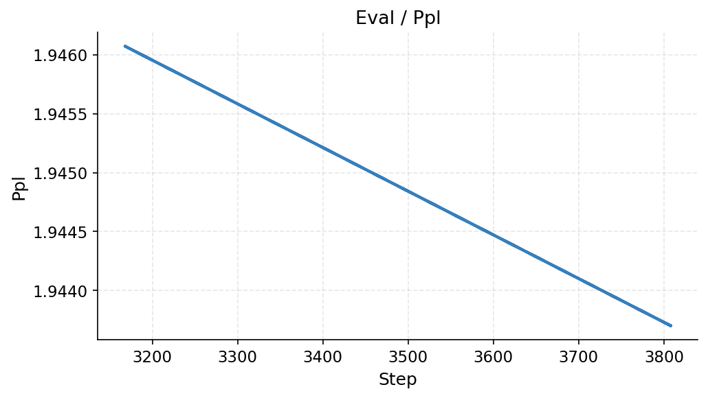

### Eval / Probs

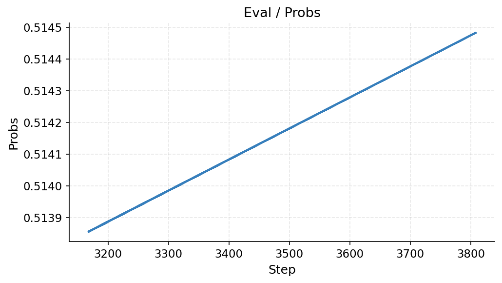

### Eval / Step Act Acc

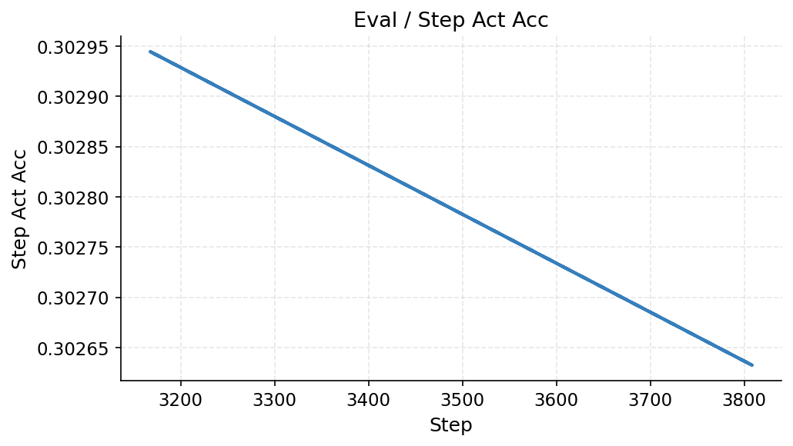

### Eval / Task Longest

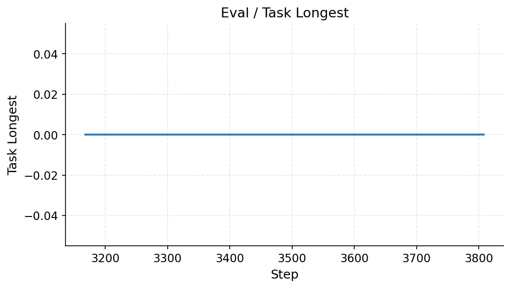

### Eval / Task Success

### Train / Ppl

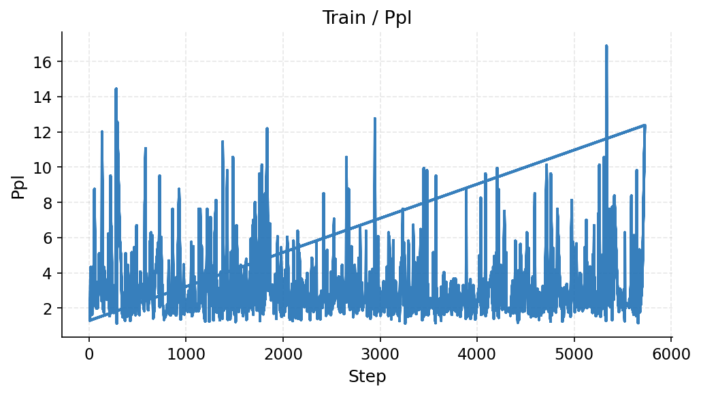

### Train / Weight

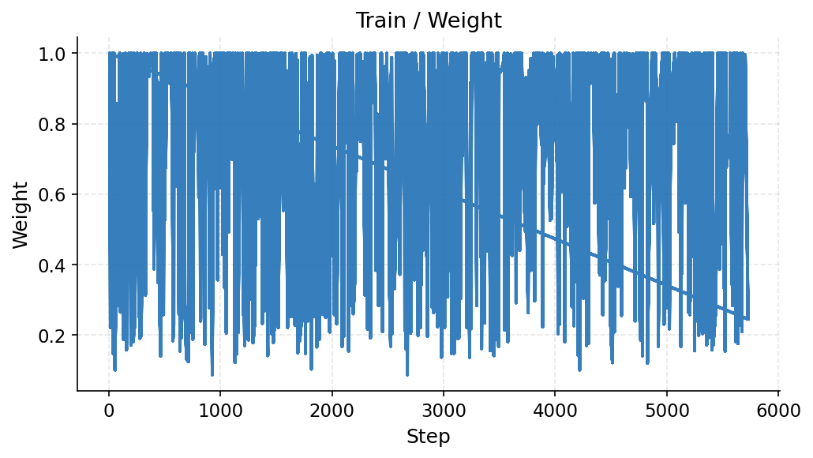
