# Training Report: act-lm-snorkel-finance-pt-aprm-fs1-19-mt4k-rgen2_sl_al_eg5-s0

> Auto-generated 2026-03-07 01:12 UTC from [W&B run](https://wandb.ai/hazy-research/act-prm-tinker/runs/3aa1vliw)

## Run Metadata

| Field | Value |
|-------|-------|
| **Run ID** | `3aa1vliw` |
| **Status** | crashed |
| **Started** | 2026-02-01T20:58:06Z |
| **Steps** | 25567 |
| **env_config** | `act_lm/snorkel_finance_pt_aprm_fs1_19_mt4k` |
| **eval_env_config** | `None` |
| **model_config** | `hf_qwen3_8b` |
| **lora_config** | `r8_a16_qkvo` |
| **trainer_config** | `pt_sft_gen5` |
| **learning_rate** | `0.001` |
| **mini_batch_size** | `32` |
| **gradient_accumulation_steps** | `32` |
| **seed** | `0` |
| **replicate** | `gen2_sl_al_eg5` |
| **group_size** | `None` |
| **hide_observations** | `True` |
| **actions_only** | `True` |

## Latest Metrics

| Metric | Value |
|--------|-------|
| actions_data_gen_save_path | ./logs/act_lm_snorkel_finance_pt_aprm_fs1_19_mt4k/Qwen3_8B/act-prm-tinker-isas=0-reru=0-enco=act_lm_snorkel_finance_pt_aprm_fs1_19_mt4k-trco=pt_sft_gen5-moco=hf_qwen3_8b-loco=r8_a16_qkvo-gracst=32-acon=1-hiob=1-lera=0_001-mibasi=32-nuevgesa=100-se=0-re=gen2_sl_al_eg5/eval_gen_action_metrics.csv |
| actions_data_lm_save_path | ./logs/act_lm_snorkel_finance_pt_aprm_fs1_19_mt4k/Qwen3_8B/act-prm-tinker-isas=0-reru=0-enco=act_lm_snorkel_finance_pt_aprm_fs1_19_mt4k-trco=pt_sft_gen5-moco=hf_qwen3_8b-loco=r8_a16_qkvo-gracst=32-acon=1-hiob=1-lera=0_001-mibasi=32-nuevgesa=100-se=0-re=gen2_sl_al_eg5/eval_lm_action_metrics.csv |
| eval/gen_longest | 0.916667 |
| eval/gen_success | 0 |
| eval/lm_best_ppl | 1.746904 |
| eval/lm_longest | 0 |
| eval/lm_nll | 0.558669 |
| eval/lm_ppl | 1.748344 |
| eval/lm_probs | 0.571970 |
| eval/lm_success | 0 |
| train/loss | 0.605469 |
| train/ppl | 1.835938 |
| train/weight | 0.999960 |

## Training Curves

### Loss

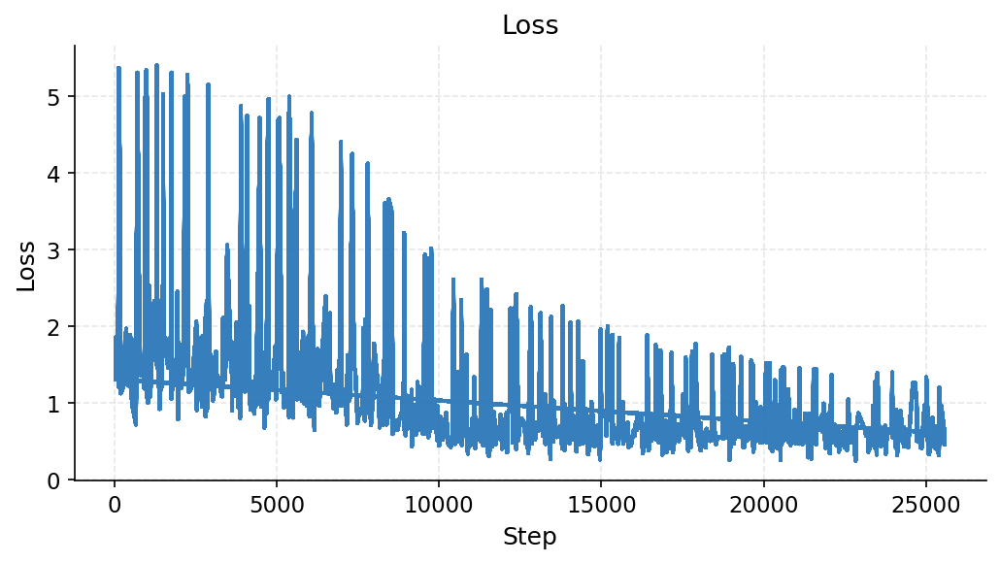

### Actions Data Gen Save Path

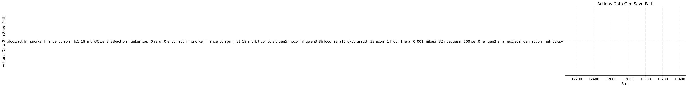

### Actions Data Lm Save Path

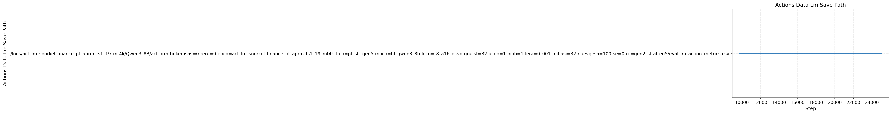

### Eval / Gen Longest

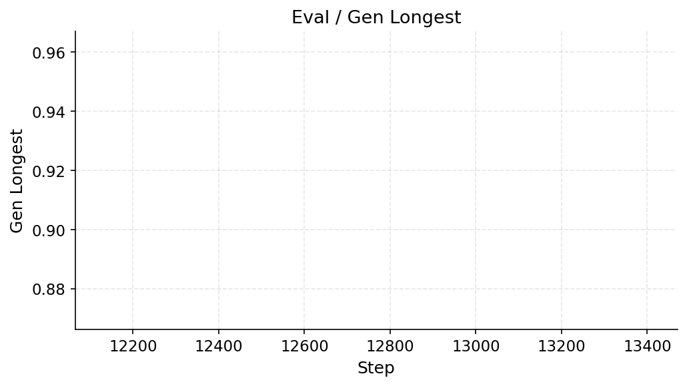

### Eval / Gen Success

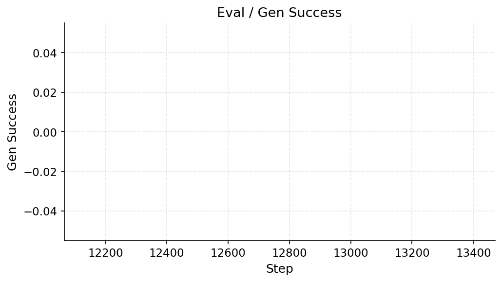

### Eval / Lm Best Ppl

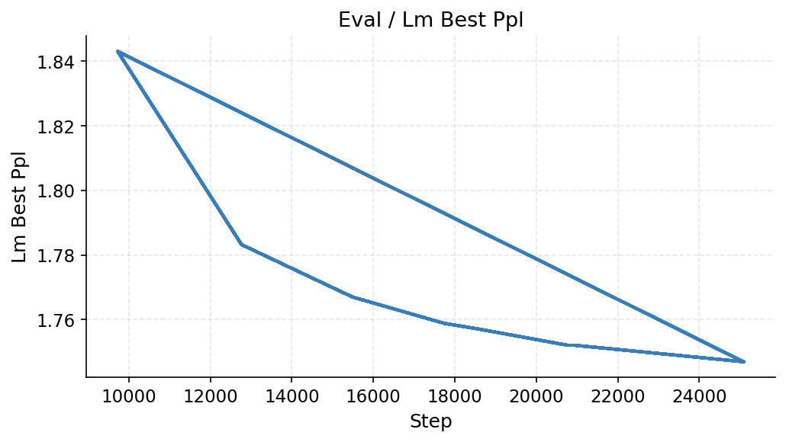

### Eval / Lm Longest

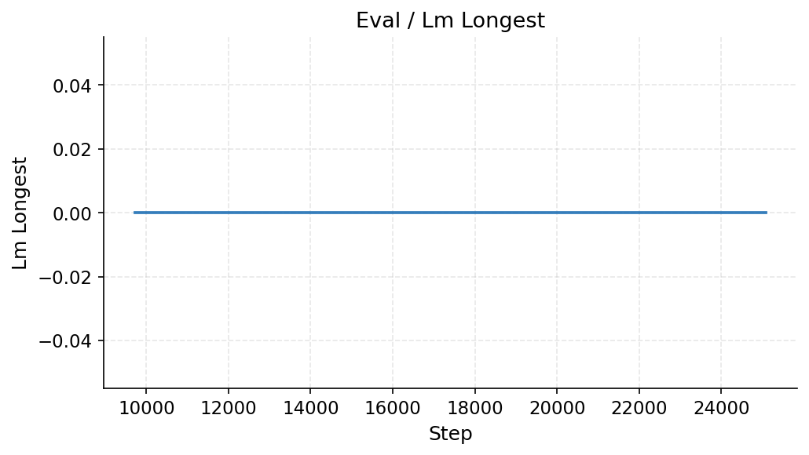

### Eval / Lm Nll

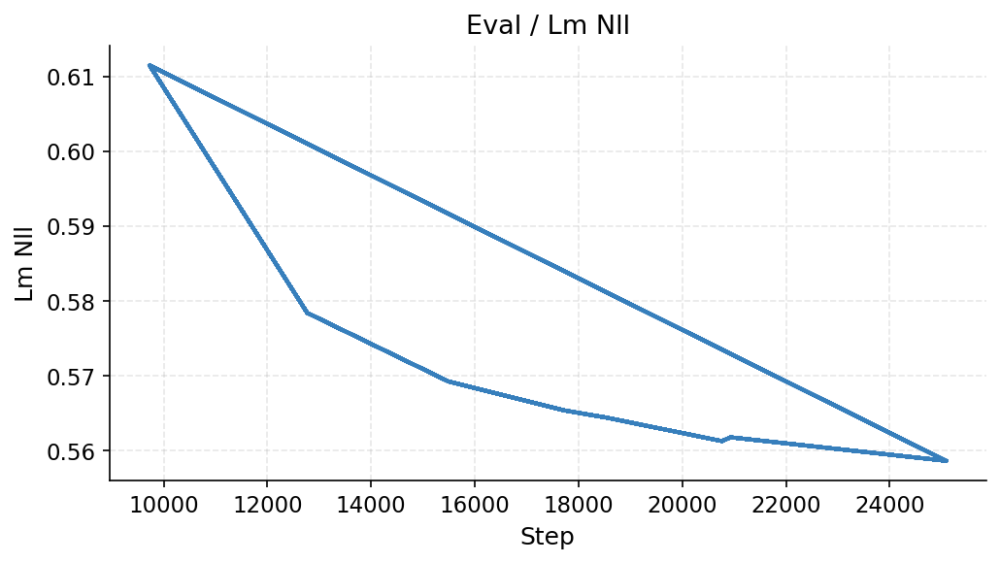

### Eval / Lm Ppl

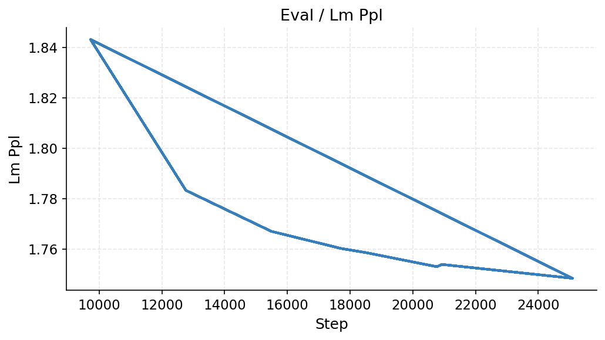

### Eval / Lm Probs

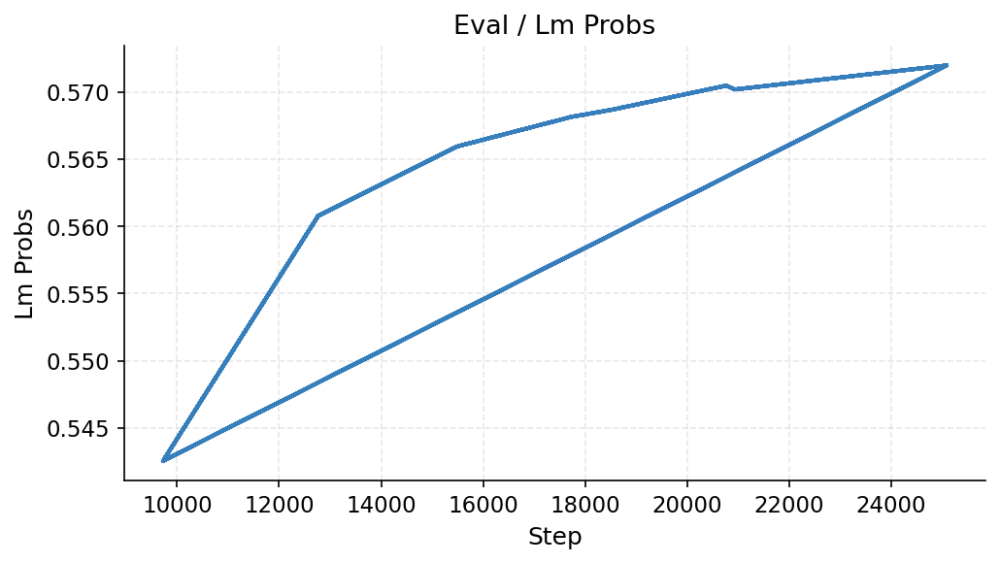

### Eval / Lm Success

### Train / Ppl

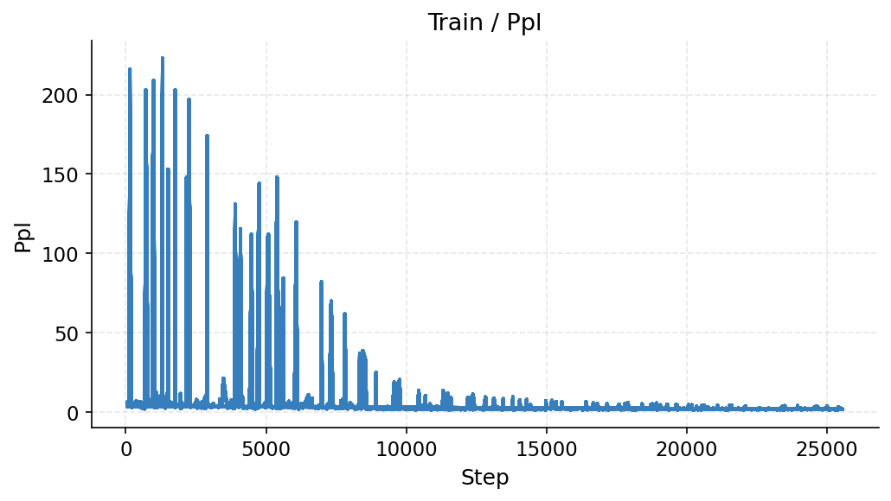

### Train / Weight

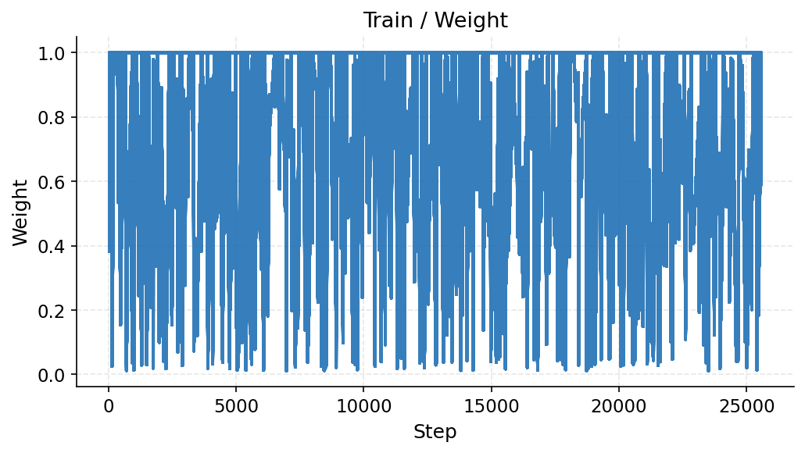
