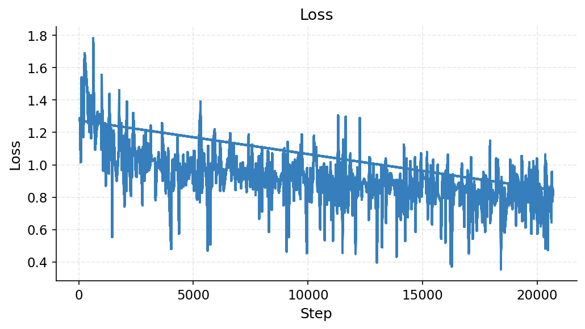
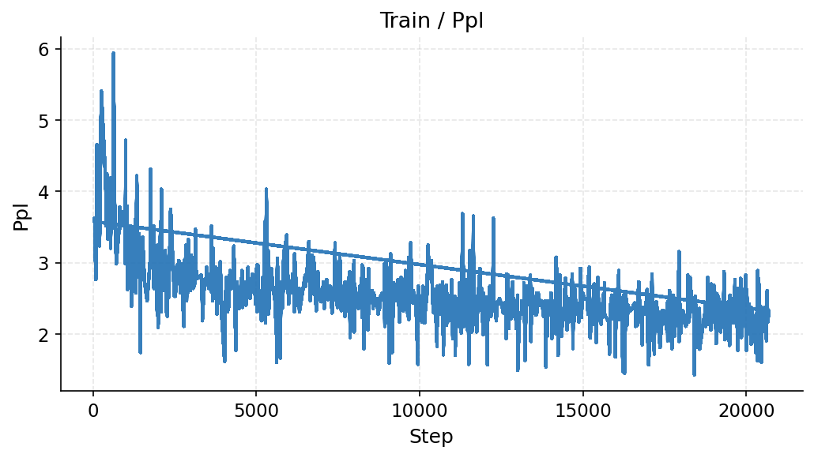
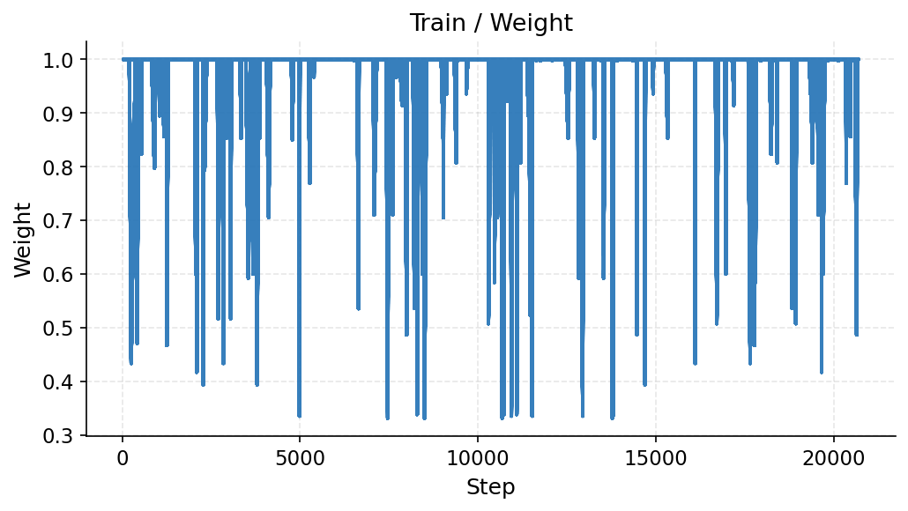

# Training Report: act-lm-tw-treasure-rgen2_sl_al_alt-s0

> Auto-generated 2026-03-07 01:12 UTC from [W&B run](https://wandb.ai/hazy-research/act-prm-tinker/runs/ssxqt8hu)

## Run Metadata

| Field | Value |
|-------|-------|
| **Run ID** | `ssxqt8hu` |
| **Status** | crashed |
| **Started** | 2026-01-30T20:12:27Z |
| **Steps** | 20692 |
| **env_config** | `act_lm/tw_treasure` |
| **eval_env_config** | `textworld/treasure_hunter` |
| **model_config** | `hf_qwen3_4b_inst_2507` |
| **lora_config** | `r16_a32_qkvo` |
| **trainer_config** | `pt_sft` |
| **learning_rate** | `0.01` |
| **mini_batch_size** | `128` |
| **gradient_accumulation_steps** | `128` |
| **seed** | `0` |
| **replicate** | `gen2_sl_al_alt` |
| **group_size** | `None` |
| **hide_observations** | `True` |
| **actions_only** | `None` |

## Latest Metrics

| Metric | Value |
|--------|-------|
| train/loss | 0.843750 |
| train/ppl | 2.328125 |
| train/weight | 0.999984 |

## Training Curves

### Loss

### Train / Ppl

### Train / Weight

